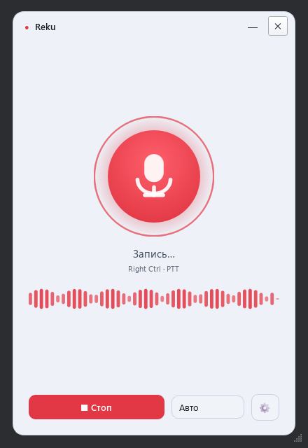

# Reku

**[English](README.md) | [Русский](README.ru.md)**

Локальная диктовка для Windows: зажми клавишу — скажи — текст появится у курсора.
Полностью офлайн: звук не покидает компьютер. Русский и английский (и ещё 90+ языков Whisper).
Два движка под одним капотом: NVIDIA CUDA (faster-whisper) и Intel iGPU/NPU (OpenVINO) —
программа сама выбирает лучшее для твоего железа, на слабом железе сама берёт модель полегче.

<p align="center">
  <picture>
    <source media="(prefers-color-scheme: dark)" srcset="docs/img/recording-dark.png">
    
  </picture>
</p>

## Почему Reku

- **Качество большой модели на обычном ноутбуке.** Большинство локальных диктовок гоняют
  Whisper на процессоре, поэтому на обычном ультрабуке им реально доступны только модели
  small/medium — large-v3 либо неподъёмна, либо мучительно медленна. Reku исполняет
  полноценную large-v3 (int8) на встроенной графике Intel через OpenVINO: обычный ноутбук
  без игровой видеокарты диктует с точностью флагманской модели. А с видеокартой NVIDIA
  работает через CUDA на полной скорости.
- **По-настоящему офлайн.** Ни облака, ни аккаунта, ни подписки — звук не покидает компьютер.
- **Всерьёз заточена под русский.** Лечит фирменные болячки Whisper: латиницу внутри
  русских слов и фантомные «титры» в паузах. Английский и ещё 90+ языков тоже работают.
- **Установка одной командой, обновление — той же.** Скрипт сам определяет железо, при
  необходимости сам ставит Python и выбирает нужный профиль зависимостей (CUDA / Intel / CPU).

## Установка

Открой PowerShell и выполни:

```powershell
irm https://raw.githubusercontent.com/Small-coder-AI/reku/main/install.ps1 | % TrimStart ([char]0xFEFF) | iex
```

`% TrimStart ([char]0xFEFF)` снимает BOM: под Windows PowerShell 5.1 `irm` отдаёт скрипт
с ведущим U+FEFF, и `iex` принимает первую строку-комментарий за команду «#».
Скрипт сам определит железо, поставит только нужное (~1–3 ГБ) и сделает ярлыки.
Модель распознавания скачается при первом запуске. Обновление — та же команда.
Удаление: скачать install.ps1 и запустить с ключом `-Uninstall`.

Если `irm` падает с ошибкой «Базовое соединение закрыто» — в этой сессии
Windows PowerShell выключен TLS 1.2. Включи его и повтори команду установки:

```powershell
[Net.ServicePointManager]::SecurityProtocol = [Net.ServicePointManager]::SecurityProtocol -bor [Net.SecurityProtocolType]::Tls12
```

### Альтернатива: инсталлятор со страницы релизов

Скачай `Reku-setup.exe` со [страницы релизов](https://github.com/Small-coder-AI/reku/releases)
и запусти — установка per-user, без прав администратора. Windows SmartScreen может
предупредить «Система Windows защитила ваш компьютер» — нажми **«Подробнее» → «Выполнить
в любом случае»** (приложение не подписано платным сертификатом, но исходники открыты).
Инсталлятор включает **оба** движка (CUDA + OpenVINO), поэтому он заметно тяжелее
установки скриптом — скрипт остаётся рекомендуемым путём.

### Альтернатива: через uv (для разработчиков)

С установленным [uv](https://docs.astral.sh/uv/) выбери extra под своё железо:

```powershell
uv tool install "reku[cuda] @ git+https://github.com/Small-coder-AI/reku"    # NVIDIA GPU
uv tool install "reku[intel] @ git+https://github.com/Small-coder-AI/reku"   # Intel iGPU/NPU
uv tool install "reku @ git+https://github.com/Small-coder-AI/reku"          # только CPU
```

Дальше — команда `reku` в **новом** окне терминала. Настройки и модели живут в `%APPDATA%\Reku`.
Обновление: `uv tool upgrade reku`.

## Использование

```powershell
.venv\Scripts\pythonw.exe -m reku      # GUI (окно + трей, без консоли)
.venv\Scripts\python.exe -m reku       # GUI (с консолью для логов/латентности)
```

Окно: тёмное безрамочное, mic-orb (статус цветом), живой вэйвформ при записи,
карточка с распознанным текстом, кнопка записи, выбор языка, шестерёнка → настройки
(модель/устройство/точность/хоткей/режим/VAD/фильтр). Закрытие окна → сворачивание
в трей; выход — из меню трея.

Дождись **Готово…** (модель грузится ~6 с) — затем зажми хоткей (по умолчанию правый
Ctrl), скажи фразу, отпусти. Текст вставится по курсору. **Держи запущенным один
инстанс** — каждый грузит свою копию модели в VRAM.

Трей-меню переключает режим и язык на лету (пишет в `config.json`).

## Настройки — config.json

Создаётся при первом запуске. Ключевое:

| параметр | по умолчанию | смысл |
|---|---|---|
| `model` / `compute_type` | `large-v3` / `auto` | какую модель грузить; `large-v3-turbo` — почти то же качество, в разы быстрее |
| `device` | `auto` | `auto` → CUDA → Intel GPU (OpenVINO) → CPU; явно: `cuda`/`igpu`/`npu`/`cpu` |
| `hotkey` | `ctrl_r` | имя клавиши pynput (`ctrl_r`, `f9`, …) или один символ |
| `mode` | `ptt` | `ptt` — зажим; `toggle` — нажал/нажал |
| `theme` | `system` | `system` (за темой Windows) / `dark` / `light` |
| `language` | `"ru"` | `"ru"` фиксирует язык (меньше латиницы внутри слов); `""` — авто |
| `initial_prompt` | русский якорь | смещает декодер к кириллице; держи русским, термины — в `hotwords` |
| `hotwords` | пусто | свои бренды/термины через запятую (напр. `GitHub, Docker, 1С`) — точечный биас |
| `beam_size` | `5` | `1` быстрее, `5` точнее |
| `vad_filter` | `true` | режет тишину/шум — **главная** защита от галлюцинаций |
| `condition_on_previous_text` | `false` | `false` = меньше петель-повторов |
| `no_repeat_ngram_size` | `3` | запрет повтора n-грамм при декоде |
| `drop_hallucinations` | `true` | резать многословные титры-фантомы Whisper (блок-лист в postprocess.py) |
| `min_language_probability` | `0.0` | `>0` (напр. 0.4) — глушить вывод, если язык распознан неуверенно (вероятно не речь) |
| `insert_method` | `paste` | `paste` (буфер+Ctrl+V) или `type` (посимвольно) |

**Латиница внутри русских слов** лечится связкой `language="ru"` + русский `initial_prompt`
+ термины в `hotwords` (см. `scripts/ab_test.py` — сравнивает конфиги на одном дубле голоса и
печатает «% смешанных слов»). **Тема** переключается в настройках на лету; `system`
следует Windows. Если модель не загрузилась (нет сети/устройства) — окно показывает
**«Ошибка»** с причиной, а не виснет в «Загрузке».

## Разработка

```powershell
git clone https://github.com/Small-coder-AI/reku && cd reku
python -m venv .venv
.venv\Scripts\pip install -r requirements.txt
.venv\Scripts\python -m reku        # запуск
Get-ChildItem tests\test_*.py -Exclude test_frozen_smoke.py | ForEach-Object { .venv\Scripts\python $_.FullName }   # тесты
```

Сборка exe (запасной путь):

```powershell
.\packaging\build.ps1              # обычная сборка (dist\Reku\Reku.exe)
.\packaging\build.ps1 -Installer   # + инсталлятор (installer\Reku-setup.exe)
```

Результат: `dist\Reku\Reku.exe` (двойной клик, иконка в трее). Модель (~3 ГБ) **не вшита** — качается при первом запуске в `%APPDATA%\Reku\models\`.
Смоук-проверка сборки: `tests\test_frozen_smoke.py` (переменная `REKU_SMOKE_DEVICE` = `cuda` на NVIDIA-машине или `igpu` на Intel).

**Инсталлятор** (Inno Setup, per-user — без админ-прав) ставит в `%LOCALAPPDATA%\Programs\Reku`, делает ярлык в Пуске (+ опц. рабочий стол),
опц. автозапуск и деинсталлятор. Нужен Inno Setup: `winget install JRSoftware.InnoSetup`.

**Релизы**: пуш тега `vX.Y.Z` запускает CI (`.github/workflows/release.yml`), который
собирает тот же инсталлятор и прикладывает его к GitHub Release. Перед тегом подними
`version` в `pyproject.toml` и `__version__` в `reku/__init__.py` — CI сверяет их с тегом.

## Как это работает

### Почему cuda_setup.py (важная заметка про GPU)

CTranslate2 на Windows грузит `cublas64_12.dll` / `cudnn*.dll` через голый
`LoadLibrary`, который ищет их только рядом с `ctranslate2.dll`, в System32 и в
**PATH**. pip-пакеты `nvidia-*` кладут DLL в `site-packages/nvidia/<lib>/bin`,
которого в PATH нет. `os.add_dll_directory()` ct2 **не видит** (тот флаг чтит ctypes,
не ct2). Поэтому `cuda_setup.py` добавляет эти каталоги в `PATH` до импорта
faster_whisper. Без этого `encode()` падает: `cublas64_12.dll cannot be loaded`
(это похоже на «работает на CPU», но на деле — краш в фоновом потоке).
`nvidia-cuda-runtime-cu12` не нужен — ct2 линкует cudart статически.

### Intel iGPU/NPU (OpenVINO)

На машинах без NVIDIA `auto` выбирает Intel-графику через OpenVINO GenAI:
готовые int8-модели качаются с HF (`OpenVINO/whisper-*-int8-ov`, карта —
`OV_MODEL_MAP` в backends.py), первая загрузка компилирует модель под
конкретный GPU (десятки секунд, разово), дальше — кэш в `ov_cache/` и старт
~2–3 с. VAD работает (Silero из faster-whisper), фильтры галлюцинаций
работают; `min_language_probability` в этом пути НЕ действует (движок не
сообщает уверенность в языке), decode — greedy (beam_size игнорируется); `hotwords`
(словарь терминов) в этом пути тоже не действуют — движок их не принимает.
Скорость проверена на Arc 140T; на слабых iGPU (UHD 6xx и т.п.) large-v3
может компилироваться/работать долго — тогда выбери `large-v3-turbo` или
`small` в настройках. Если OpenVINO в auto-режиме не поднялся вовсе
(драйвер/память) — приложение само откатывается на CPU + small.
На машинах без NVIDIA пакеты `nvidia-*` можно не ставить
(`grep -v '^nvidia-' requirements.txt`). Бенч скорости на своих фразах:
`python scripts/bench_backends.py record`, затем `run` (отчёт в
`bench_audio/bench_results.md`).

## Файлы

- `reku/gui.py` — **десктопный UI на PySide6** (окно + трей). Основная точка входа.
- `reku/gui_theme.py` — палитра + QSS. `reku/gui_widgets.py` — MicOrb + WaveformStrip.
- `reku/dictate.py` — ядро `DictationApp` (запись→распознавание→вставка).
- `reku/config.py` / `config.json` — настройки.
- `reku/postprocess.py` — фильтр галлюцинаций (чистые функции).
- `reku/cuda_setup.py` — кладёт nvidia-DLL в PATH (см. «Почему cuda_setup.py» выше). **Импортируется первым.**
- `requirements.txt` (верхнеуровневые пины) / `requirements.lock.txt` (полный freeze).
- `reku/backends.py` — выбор и управление бэкендами (faster-whisper, OpenVINO).
- `reku/model_store.py` — загрузка и кэширование моделей.
- `tests/` — модульные тесты.
- `scripts/` — служебные скрипты (make_ico.py, bench_backends.py).
- `packaging/` — сборка .exe (build.ps1, reku.spec, reku.iss).

## Что проверено и что нет

Проверено headless (без участия пользователя):
- GPU-инференс честный (0.69 с на 4 с аудио), venv самодостаточен;
- пайплайн `transcribe`→фильтр (тишина/шум → пусто), пороги, дедуп, блок-лист;
- сборка трея (иконки, меню) без ошибок.

Требует ручной проверки (нужен реальный keypress/окно/GUI-сессия):
- вставка текста по курсору в реальном приложении;
- режим `toggle` и смена хоткея;
- появление иконки в трее, клики меню, смена цвета по статусу.

## Лицензия

MIT — см. [LICENSE](LICENSE).
